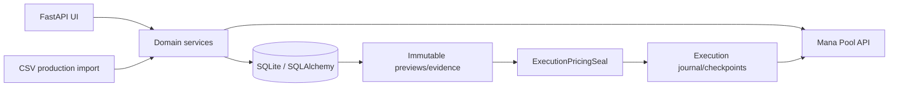

# Architecture

## Application structure

CardFoundry is a server-rendered FastAPI application. `main.py` owns routes and
HTML composition; domain rules live in flat service modules. SQLAlchemy models
are in `models.py`, SQLite configuration and additive upgrade helpers are in
`database.py`, and Mana Pool HTTP access is isolated in `manapool_service.py`.



## Data and provenance

- `Batch` groups cards from one intentional import. Archive state controls
  sellability without destroying history.
- `ImportRecord` records the source import and points to its Batch.
- `InventoryCard` is one physical-card record with printing, language,
  condition, finish, cost, status, and immutable batch provenance.
- `PendingImport` stores source hash, staged normalized representation,
  validation evidence, and expected counts. Preview creates no Batch or cards.
- `RemoteProductBinding` is validated evidence connecting exact local identity
  to a Mana Pool product when canonical MTGJSON identity is unavailable or
  deferred. Language, condition, and finish remain strict.
- `InventoryChangeLog` is append-only evidence for identity correction,
  sellability changes, manual disposition, removal, and removal-metadata
  correction.

## Inventory lifecycle

`InventoryCard.status` is authoritative:

```text
available -> unsellable -> available
available -> reserved -> sold (order workflow)
available -> sold              (guarded manual disposition)
available -> removed           (guarded inventory correction)
```

`available` alone contributes to desired seller quantity and allocation.
`unsellable` remains owned. `sold` and `removed` are historical and not owned.
Reserved/sold states cannot be overridden by general sellability controls.

Manual disposition records `local_sale`, `trade`, `gift`, or `other`. Removal
records structured correction reasons and may link a surviving InventoryCard.
Removal metadata can be amended only through a second audit event; the original
removal event is never rewritten.

## Production import pipeline

The canonical UI flow is `/imports/production-preview` followed by reviewed
`/imports/{pending_id}/confirm`. `production_import_service.py` handles both UI
and production tooling. It detects columns, expands positive integer Quantity,
defaults missing language to EN, preserves explicit language, normalizes
condition/finish, validates Scryfall/printing identity, enriches against seller
history, resolves net-new catalog products, and proposes bindings. Ambiguous,
unresolved, conflicting, incomplete, or stale evidence fails closed. Commit is
one transaction creating Batch, ImportRecord, InventoryCards, bindings, and a
sanitized audit JSON.

Printing corrections use read-only Scryfall printing search, a reviewed state
hash, and append-only audit evidence. They do not publish automatically.

## Mana Pool and synchronization

Credentials are read from `MANAPOOL_EMAIL` and `MANAPOOL_API_TOKEN`; values are
never stored in Git. Seller inventory is authoritative for post-write readback.
Order ingestion and exact allocation are in `order_service.py`; allocations
select only active-batch `available` cards. Pick-wave workflow is in
`pick_wave_service.py`.

`InventorySyncLease` serializes inventory-affecting operations. Active or
`recovery_required` maintenance executions block ordinary inventory mutations;
lease expiry allows a crashed process to be recovered without permanent
deadlock.

## Pricing

`pricing_decision_service.py` defines the shared hierarchy. Competitor pricing
uses exact printing/finish, same-or-better condition, seller exclusion, and the
lowest price across languages. `competitor_pricing_service.py` batches optimizer
requests and preserves winning evidence. `new_listing_pricing_service.py` uses
the same hierarchy for initial prices. Exact-printing/finish market data is the
second automatic source; reviewed `ManualPriceOverride` is last fallback.

Every selected price is subject to the configured absolute floor. Existing
prices below the floor are `floor_corrected_existing`; missing market evidence
does not permit a below-floor listing to remain live.

## Clean rebuild and recovery

`clean_rebuild_workflow.py` gathers orders, local state, bindings, complete
seller inventory, and pricing evidence. `clean_rebuild_service.py` constructs
blank and republish plans. The structural preview protects product sets,
quantities, identities, source classification, policy, and snapshot hashes.

`ExecutionPricingSeal` refreshes automated pricing inputs at arming time while
keeping structure immutable. Movement above $1.00 **or** 20% requires human
review; a seal expires 15 minutes after creation if writes have not started.
Manual evidence is immutable, and automatic evidence takes precedence when it
becomes available.

`clean_rebuild_executor_service.py` writes a durable execution and all batch
checkpoints before remote writes. Each batch moves through in-flight,
accepted/unreconciled, and reconciled states using seller-inventory readback.
Timeouts are treated as uncertain, never assumed failures. Recovery uses the
same approved plan and sealed prices; it never reprices midway.

The separate floor-correction workflow uses `FloorCorrectionExecution` and
`FloorCorrectionCheckpoint`. It changes only reviewed prices, submits exact
unchanged quantities, rechecks store-off state, and supports deterministic
resume.

## Audits

Production import and cutover summaries under `audits/` are sanitized,
immutable Git artifacts. Detailed execution journals, previews, seals, leases,
and transactional state remain in the local database and are excluded from
Git. See `audits/README.md` for policy.

## Future functionality

Sealed-product inventory, deck management, branded paperwork, and multi-store
productization are not implemented. See [ROADMAP.md](ROADMAP.md).
